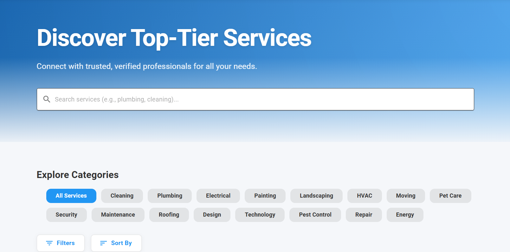
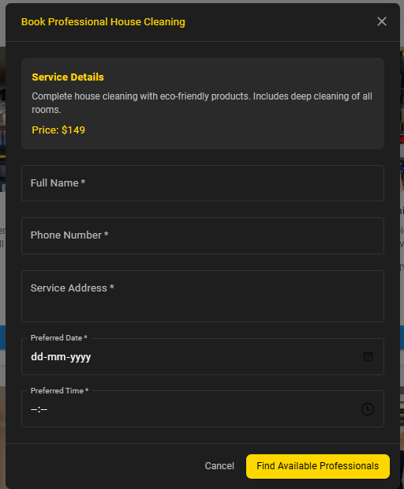

# Local Services Connector

Connect users with trusted local service providers — plus a part-time gigs marketplace for students and freelancers. Built with **React + Tailwind**, **Node.js + Express**, **MongoDB**, **Clerk / Firebase Auth**, and **Firebase Cloud Messaging**. Future-ready for **Razorpay/Stripe** payments.

  <a href="#features">Features</a> •
  <a href="#demo--screenshots">Demo & Screenshots</a> •
  <a href="#architecture">Architecture</a> •
  <a href="#tech-stack">Tech Stack</a> •
  <a href="#folder-structure">Folder Structure</a> •
  <a href="#quickstart">Quickstart</a> •
  <a href="#env-variables">ENV Variables</a> •
  <a href="#api-preview">API Preview</a> •
  <a href="#data-models">Data Models</a> •
  <a href="#roadmap">Roadmap</a> •
  <a href="#contributing">Contributing</a> •
  <a href="#license">License</a>

---

## Description

**Local Services Connector** is a modern web platform (similar to Urban Company) that helps users **discover, compare, and book** local service providers using **smart filtering** (location, skills, ratings, price). It also includes a **Part-Time Job Marketplace** where students/freelancers can find gigs beyond household services.

Authentication uses **Clerk** and/or **Firebase Auth** for secure, seamless login. **Firebase Cloud Messaging (FCM)** powers real-time notifications. Payments (future scope) will plug into **Razorpay** or **Stripe**.

---

## Features

- **Smart Filtering & Search**
  - Filter by **location**, **skills/tags**, **rating**, **price range**, **availability windows**.
  - Sort by **price**, **rating**, **distance**, **response time**.
- **Part-Time Gigs Marketplace**
  - Post and apply for **short-term jobs** (events, campus gigs, delivery help, etc.).
- **Secure Authentication**
  - **Clerk** (Email/Password, Social OAuth) and/or **Firebase Auth**.
  - Protected routes, session management, server-side token verification.
- **Messaging & Notifications**
  - In-app messages (basic) and **FCM push notifications** for bookings and job status.
- **Reviews & Ratings**
  - Verified reviews to build trust between customers and providers.
- **Responsive UI/UX**
  - **React + Tailwind** for fast, accessible, mobile-first interfaces.
- **Payments (Future)**
  - Pluggable **Razorpay/Stripe** checkout for bookings and payouts.

---

## Demo & Screenshots

> Replace the image paths with your actual screenshots.

- 
- 
- 
- 
- 
- 
